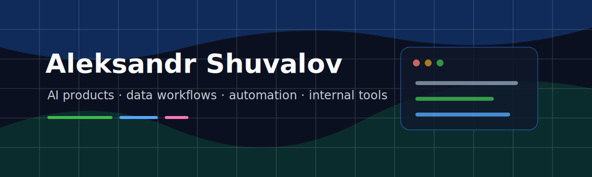

  

<h1 align="center">Aleksandr Shuvalov</h1>

  IT specialist focused on AI products, data workflows, automation, and practical software for real-world operations.

  
  
  

---

### About

I work at the intersection of software engineering, data analysis, and technology product management. My background combines hands-on development, startup execution, grant-backed product work, and business analysis.

I am especially interested in AI-enabled products, document/data workflows, automation, and internal tools that make complex processes easier to operate. I value clear architecture, fast validation, and software that survives contact with real users.

### Currently

- studying Computer Science / IT at the master&apos;s level;
- building and documenting practical experiments in AI, data, and automation;
- improving my engineering depth across Python, JavaScript/TypeScript, SQL, and ML basics;
- turning startup/product experience into stronger technical execution.

### Professional Focus

- AI product development, from concept and architecture to implementation support;
- data analysis, SQL workflows, and decision-support tooling;
- automation scripts, parsers, and operational utilities;
- web interfaces, admin tools, and product prototypes;
- startup/product strategy, market research, and stakeholder communication.

### Toolbox

  
  
  
  
  
  
  
  
  
  
  
  
  

### Track Record

| Signal | Details |
| --- | --- |
| Product building | Co-founder experience across AI, healthcare, tourism, fitness, and hardware-related startup projects |
| Grant-backed work | Participated in projects supported by the Foundation for Assistance to Innovations, with 5M RUB in total grant funding across several teams |
| MedAI | Co-founder; contributed to the architecture of a medical AI application for pediatric immunosuppression workflows |
| Accelerators | Finalist / participant in startup accelerators and competitions including MSU, Sber, SUSU, HSE, and Peter the Great St. Petersburg Polytechnic University |
| Education | M.S. student in Computer Science / IT, Digital Ural; B.S. background from South Ural State University |

### Selected Work

| Project / Area | Role and contribution |
| --- | --- |
| MedAI | Co-founder; contributed to the architecture of a medical AI application for doctors working with pediatric patients on immunosuppressive therapy |
| MyTourism | Co-founder; worked on an AI-assisted leisure discovery product concept |
| Charity Workout | Co-founder; participated in an inclusive fitness product for people with disabilities |
| EasyFind | Co-founder; worked on a consumer tracker product concept for the Russian B2C market |
| Market and product analysis | Researched industry trends, business models, and product opportunities to support strategic decisions |

### What You&apos;ll Find Here

- prototypes and experiments around AI, data, automation, and product tooling;
- utilities for parsing, preprocessing, validation, and operational workflows;
- web interfaces and dashboards for making technical systems easier to use;
- notes and code that show how ideas move from research to working software.

### Repository Roadmap

I am gradually shaping this GitHub profile into a public workspace for practical engineering artifacts:

- `document-ai-lab` - OCR, preprocessing, and document workflow experiments;
- `data-workflow-utils` - small tools for parsing, cleaning, and validating data;
- `ai-product-prototypes` - compact product experiments around AI-assisted workflows;
- `startup-research-toolkit` - templates and scripts for market and product analysis.

### Operating Principles

- Build useful things first, then improve the architecture with evidence.
- Keep systems observable: logs, previews, checks, and clear failure states matter.
- Treat product context as part of engineering, not as something separate from it.
- Prefer maintainable tools over impressive demos that are hard to operate.

### GitHub

  
  

---

  <i>Building practical AI and data tools with a product mindset.</i>

